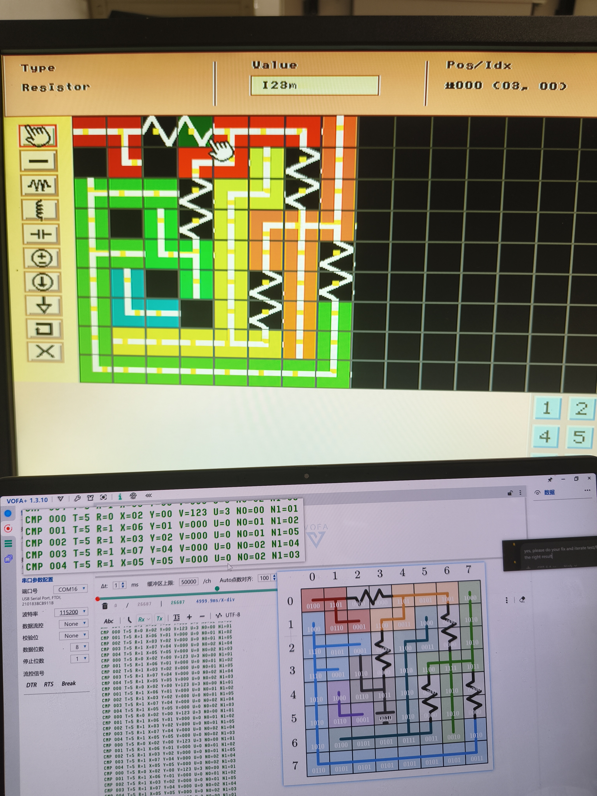
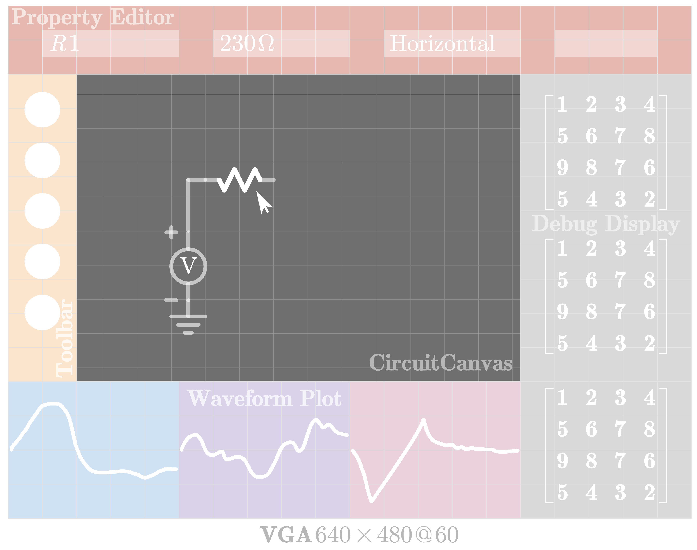
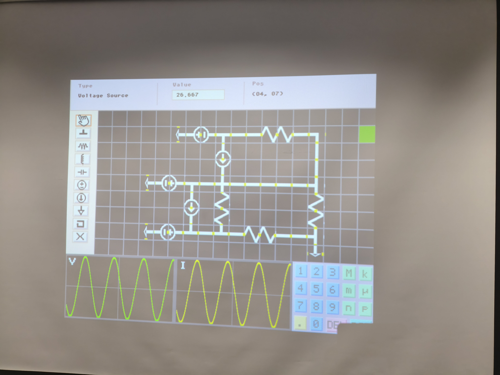
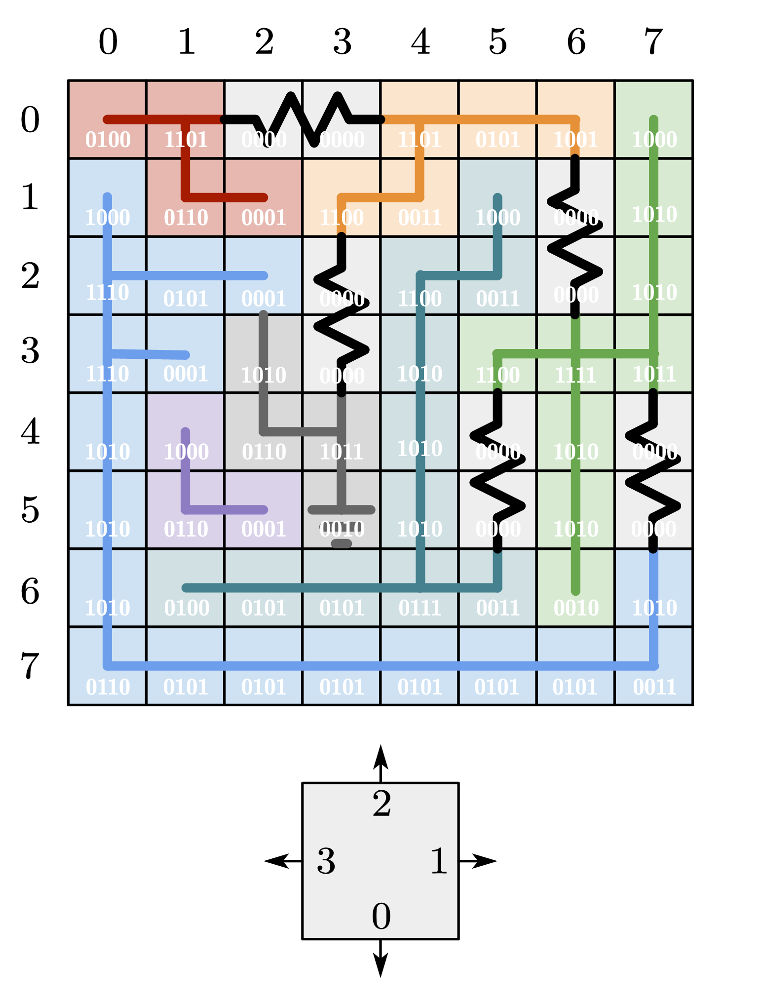
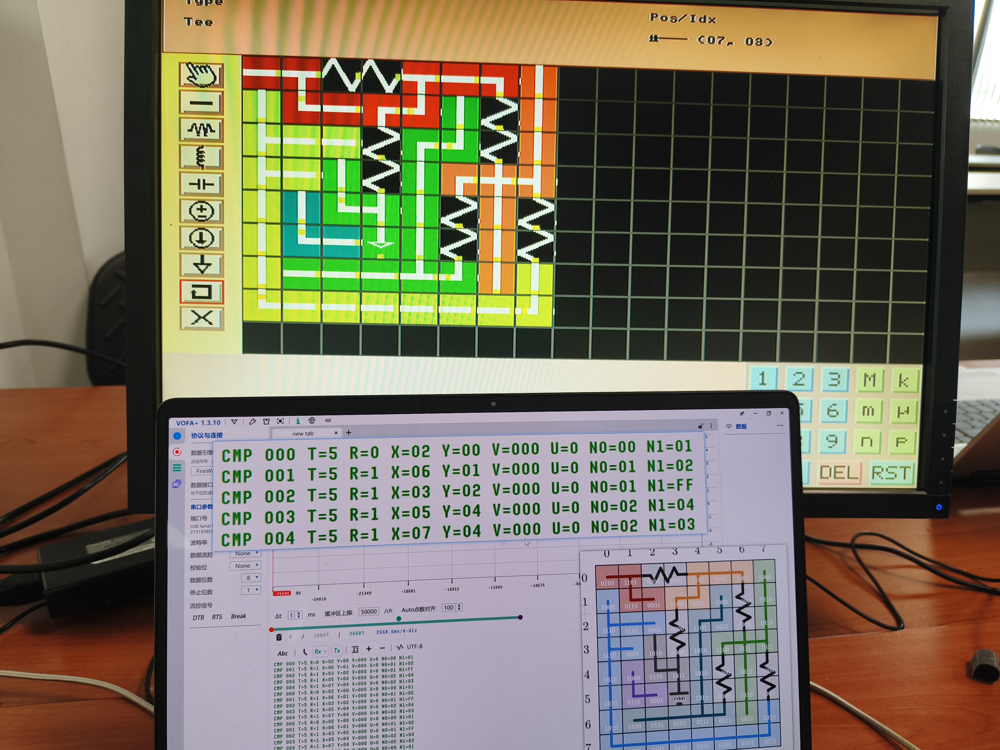

# MetaCircuit

- **Team Member:** Chen Shimin, Hsu Yuchen, Xie Ziyi, Wang Zhirui
- **Final Grade: A**

An interactive circuit design and visualization system built on the Digilent Basys 3 FPGA.

NUS EE2026 AY2025/26 Semester 2, Session 1 Group 9.

<p align="center">
  
</p>

MetaCircuit turns the FPGA into a mouse-driven circuit editor. Users draw a circuit on a 640x480 VGA canvas, edit component values with an on-screen keyboard, inspect connectivity, and send the extracted netlist to a floating-point DC solver.

## Highlights

- Interactive VGA canvas with panning, selection, rotation, and deletion.
- Wire, junction, elbow, tee, ground, resistor, inductor, capacitor, voltage-source, and current-source tools.
- Property panel and virtual keyboard for component values and SI units.
- RAM-backed cell and component stores with animated current direction and node-color overlays.
- Flood-fill connectivity extraction that converts the drawing into node-labelled components.
- Framed, checksummed UART snapshots between the frontend and solver paths.
- IEEE-754 MNA stamping and LU decomposition with partial pivoting for DC circuits.
- Matrix, waveform, seven-segment, LED, and optional OLED diagnostic displays.

## From design to hardware

<table>
  <tr>
    <td align="center" width="50%">
      <br>
      <sub>Initial interface design</sub>
    </td>
    <td align="center" width="50%">
      <br>
      <sub>Integrated VGA interface</sub>
    </td>
  </tr>
</table>

## Architecture

```text
PS/2 mouse
    |
    v
VGA editor -> cell/component stores -> connectivity flooding -> netlist snapshot
                                                               |
                                                               v
Host relay or solver Basys 3 <- UART -> MNA stamping -> pivoted LU solve
                                                               |
                                                               v
Frontend voltage display <- UART voltage snapshot <------------+
```

The current repository separates the live frontend from the matrix-compute path:

- `GlobalRender_top` is the main VGA frontend. It owns interaction, rendering, component storage, flooding, netlist extraction, and the frontend UART client.
- `SolverBoard_top` receives complete netlist snapshots, converts BCD and SI-unit values to float32, stamps the DC system, solves it, and returns node voltages.
- `src/uart_link` provides the matching Python protocol, relay, hardware testers, and a host-side simulated solver.
- `simpyhls` is the HLS/compiler submodule used to lower restricted Python solver kernels into readable RTL.

<p align="center">
  
</p>

Each cell stores four directional connectivity bits. Flooding groups connected cells into nodes; component endpoints are then translated into solver-facing node indices.

<p align="center">
  
</p>

## Current scope

The default `GlobalRender_top` build enables the property panel and frontend UART path. Waveform and OLED-calculator blocks remain available in the source tree but are disabled by local parameters.

The DC solver currently stamps:

- resistors;
- independent current sources;
- independent voltage sources.

The editor can also place inductors and capacitors, but those elements are not yet handled by the DC solver.

## Repository map

```text
assets/                 Project photos and design diagrams
docs/                   Requirements, proposal, final report, and verification notes
notebooks/              Python circuit, flooding, compiler, and solver experiments
simpyhls/               Python-to-Verilog compiler submodule
src/
  constraint/           Basys 3 pin and clock constraints
  design/
    common/             RAMs, buffers, and shared combinational packages
    Dashboard/          Property, text, and matrix displays
    interaction/        Frame capture and canvas command logic
    matrix/             Matrix/vector stores and LU cores
    rendering/          VGA canvas, toolbar, cursor, and waveform renderer
    solver/             Connectivity extraction and generated DC solver
    solver_board/       Solver-board UART and orchestration
    uart/               Frontend UART transport
  testbench/            RTL unit and integration testbenches
  uart_link/            Python protocol, relay, and board testers
```

## Getting started

### Vivado frontend

The main project recreation script targets Vivado 2018.2 and the Basys 3 `xc7a35tcpg236-1`.

```powershell
git submodule update --init --recursive
vivado -mode batch -source metacircuit.tcl
vivado -nojournal -nolog .\metacircuit\metacircuit.xpr
```

`GlobalRender_top` is selected as the project top module. Generate the bitstream from Vivado after the project opens.

### Solver-board synthesis

```powershell
vivado -mode batch -source solver_board_synth.tcl
```

This synthesizes `SolverBoard_top` and writes utilization and timing summaries in the repository root.

### Python tools and notebooks

Python 3.14 and [`uv`](https://docs.astral.sh/uv/) are used for the host tools and notebooks.

```powershell
uv sync
uv run python -m unittest discover -s src\uart_link\tests -v
```

For the four reference notebooks, open `notebooks/` and select `.venv\Scripts\python.exe` as the kernel. The notebooks preserve the software models used for circuit stamping, connectivity flooding, compiler exploration, and solver validation.

Hardware-facing UART examples:

```powershell
uv run python -m src.uart_link.solver_tester --list
uv run python -m src.uart_link.solver_tester --port COM16
uv run python -m src.uart_link.frontend_tester --port COM16 --once
```

See [`src/uart_link/README.md`](src/uart_link/README.md) for packet formats and bring-up details.

## Documents

- [FDP requirements](docs/EE2026%20FDP%20Requirements.pdf)
- [Project proposal](docs/EE2026%20FDP%20Proposal.pdf)
- [Final report](docs/EE2026%20FDP%20Final%20Report.pdf)

## IDE setup

VS Code was used as Vivado's external editor. Useful tooling:

- [Verilog-HDL/SystemVerilog/Bluespec](https://marketplace.visualstudio.com/items?itemName=mshr-h.VerilogHDL)
- [Universal Ctags](https://github.com/universal-ctags/ctags)
- [Verible](https://github.com/chipsalliance/verible) for formatting, linting, and language-server support

The checked-in `.rules.verible_lint` supplies the project lint configuration.
